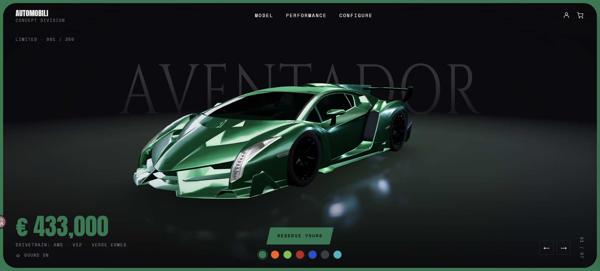

<div align="center">

# AVENTADOR — CONCEPT

**A cinematic 3D supercar showcase with a live paint configurator.**
Scroll to rotate the car, drag to spin it, tap a colour to repaint the entire page.



<sub>Built with React Three Fiber · GSAP · Lenis · Tailwind CSS</sub>

</div>

---

## Demo

<!-- ─── DROP YOUR GIF HERE ───────────────────────────────────────
     1. Record a short screen capture (scroll through the 5 slides,
        then click a few colour swatches).
     2. Save it as docs/demo.gif  (aim for < 10 MB so GitHub inlines it)
     3. The tag below will pick it up automatically — nothing else to edit.
     ──────────────────────────────────────────────────────────── -->

<div align="center">
  
</div>

> **Live site:** _coming soon_ — deploy the `dist/` folder to Vercel, Netlify or GitHub Pages and drop the link here.

---

## What it does

- **Scroll choreography** — the car rotates continuously through the whole page while the camera dollies in. Rotation reads a scroll-progress ref and is lerped inside `useFrame`, so it never jitters and never freezes between sections.
- **Full-page section snapping** — five 100vh slides, one eased slide per scroll gesture, driven through Lenis (not a hard jump). Falls back to free scroll under `prefers-reduced-motion`.
- **Live configurator** — 7 finishes. Selecting one tweens the car's paint with a front-to-back **paint sweep**, retints the rim light, and animates the `--accent` CSS variable, so the price, CTA, swatch ring and frame all repaint in step.
- **Drag to rotate** — pointer-down on empty stage spins the car with inertia; every UI control stays clickable above it.
- **Reactive stage** — mirror floor (`MeshReflectorMaterial`), contact shadows, ACES filmic tone mapping, and selective bloom on desktop.
- **Reserve interaction** — the CTA flashes the headlights, kicks up tyre smoke, rocks the chassis and revs the engine audio.
- **In-memory cart** — add a configured spec, open the drawer, see the subtotal. No backend, no storage APIs.
- **Responsive** — a dedicated vertical hero composition for mobile/tablet: car high in the frame, full-width CTA pinned low, arrows stacked on the right edge. Bloom off and dpr capped below 768px.

### The five slides

| # | Slide | Car position | Content |
|---|-------|--------------|---------|
| 1 | Hero | centre | Wordmark, price, CTA, 7 swatches, pagination |
| 2 | Dimensions | left | Length · width · height · dry weight |
| 3 | Performance | right | 0–100 · top speed · max power · displacement |
| 4 | Limited Edition | centre | Badges arranged around the car |
| 5 | Outro | fades out | "DEFY LIMITS." final CTA + footer |

---

## Stack

| Layer | Tool |
|---|---|
| Build | Vite 8 + React 19 + TypeScript |
| 3D | `three` · `@react-three/fiber` · `@react-three/drei` · `@react-three/postprocessing` |
| Animation | `gsap` (+ ScrollTrigger) · `lenis` |
| State | `zustand` (in-memory only — no localStorage anywhere) |
| Styling | Tailwind CSS |
| Type | Anton (display) · Cinzel (watermark) · Inter (UI) · Space Mono (data) |

---

## Getting started

Requires **Node 18+** (developed on Node 24).

```bash
git clone https://github.com/amir-gilani/aventador-concept.git
cd aventador-concept
npm install
npm run dev
```

Then open the URL Vite prints (usually `http://localhost:5173`).

| Command | Does |
|---|---|
| `npm run dev` | Dev server with HMR |
| `npm run build` | Type-check + production build into `dist/` |
| `npm run preview` | Serve the production build locally |
| `npm run lint` | Oxlint |

---

## Project structure

```
src/
  App.tsx                    Lenis init, ScrollTrigger sync, layout shell
  scene/
    Experience.tsx           <Canvas>, camera, lights, environment, postprocessing
    CarModel.tsx             the ONLY file that knows what the car is
    Stage.tsx                reflective floor, contact shadows, ground glow
    interaction.ts           pointer parallax + drag-to-rotate state (no re-renders)
    useScrollProgress.ts     0..1 scroll progress in a shared ref
  scroll/
    sectionSnap.ts           full-page eased snapping through Lenis
  store/
    useConfig.ts             finishes, active index, --accent tweening
    useCart.ts               in-memory cart
    useFx.ts                 headlight flash bus + engine audio
  ui/                        Navbar, Hero, the four slides, CartDrawer, Loader, Footer
public/
  models/car.glb             the car
  engine.mp3                 rev sample
```

---

## Tuning it

Everything you'd normally want to change lives behind a named constant:

| Want to change | Where |
|---|---|
| Colours, names, prices | `FINISHES` in [`src/store/useConfig.ts`](src/store/useConfig.ts) |
| Camera framing (fov 38, start `[4.4, 1.7, 6.2]`) | [`src/scene/Experience.tsx`](src/scene/Experience.tsx) |
| Car size on screen | `TARGET_LENGTH` / `FIT_ADJUST` in [`src/scene/CarModel.tsx`](src/scene/CarModel.tsx) |
| Where the car sits per slide | `CAR_X` / `CAR_Y` / `CAR_Z` / `SCALE_SLIDE` in `CarModel.tsx` |
| Resting pose & rotation range | `REST_X/Y/Z`, `ROT_Y_SLIDE` in `CarModel.tsx` |
| Snap feel | `SNAP_DURATION` / `TAIL_MS` in [`src/scroll/sectionSnap.ts`](src/scroll/sectionSnap.ts) |
| Paint material | the `MeshPhysicalMaterial` block in `CarModel.tsx` |

### Swapping the 3D model

All geometry is isolated in `CarModel.tsx` behind the **GLB SWAP POINT** comment — nothing outside that file references the car's shape.

1. Drop the new file at `public/models/car.glb`.
2. If it's Draco-compressed, give `useGLTF` a decoder path.
3. Update the mesh-name rules that assign paint / glass / rubber materials.

The car is **auto-fitted** on load: its bounding box is measured, recentred to the origin, and uniformly scaled so its longest axis equals `TARGET_LENGTH`. Any model, at any native scale, lands in the same on-screen framing — no manual position guessing.

---

## Accessibility

`prefers-reduced-motion` is respected throughout: the load sequence and idle drift are skipped, scroll hijacking is disabled in favour of normal scrolling, and the car still rotates with scroll at a higher lerp factor.

---

## Disclaimer

This is a **portfolio / concept piece**, not affiliated with, endorsed by, or connected to any vehicle manufacturer. No official logos or trademarks are used. Model names, specs and prices are illustrative placeholders.

---

<div align="center">
<sub>© 2026 — built by <a href="https://github.com/amir-gilani">Amir Barzegar</a></sub>
</div>
